# Mini Robot Arm!!

In this guide, we will be making a custom wirelessly controlled 2 servo robot arm!

Here are the parts in your Kit Lab kit along with what will be used:
|Kit Parts|Quantity|
|---------|--------|
|RPi Pico|2|
|nRF24L01+|5|
|RGB LED|5|
|INA3221|1|
|MPU6500|1|
|Pushbuttons|20|
|830P Breadboard|1|
|Jumper Wires|1 Bundle|
|Servo Motor|2|
|1N4733A Diodes|5|
|Mixed Value Resistors|1|

|Parts We Will Need|Quantity|
|------------------|--------|
|RPi Pico|2|
|nRF24L01+|2|
|MPU6500|1|
|Servo Motor|2|

Note: Be sure to customize this project and not just directly copy it. (Add a LED, Buttons?)

Lets start with our project now!

# Creating a schamatic

First of all, we need to plan out how things will be connected to our PCB! We don't just wanna mindlessly add and connect things since you would not know what is connected to where, causing you to have a PCB that will not work with your project. This is where schematics come into play. Schamatics help you plan out what things will be used and how they will be connected to each other. We will begin by installing KiCad, KiCad is a simple tool which is really easy to learn and beginner friendly! Go install KiCad at: https://www.kicad.org/ and open it! Next, look at the top-left corner and click the create project button, which looks like this: 

After that, name your project and click on this to open your schematic:

Now, what we want to do is add symbols. Symbols are the modules that you would conenct to your PCB and this will help you connect things. Press A and them type in RP2040, then scroll down and select the Raspberry Pi Pico, this will act like the brain of our robot arm's reciever and transmitter. Then place your Pico somewhere on the schematc area and then add another pico since we will need 2 (one for the reciever and one for the transmitter):

Now we will add the gyroscope module (MPU-6500) to the schematic.
If we check for the MPU-6500 in the symbools, we will only see the chip of the PCB, but we have a module. The difference is that modules have the tiny chip soldered to it already and can be easily connected with header pins. Now back to KiCad, we do not see that there is a MPU-6500 module so what we will do is just use a 01x10 pin connector. We will add another symbol, select add symbols (or press A) and then search up 01x10 and select Conn_01x10 in the Connector_Generic area and then place it down somewhere.

Now do the same but add 2 01x03 connectors for the Servos:

And for the nRF24L01+, search nRF24L01 (without the +) when you go to add symbols and select the NRF24L01_Breakout symbol and place it somewhere and also add another one since we will use 2 for this project.

Lets also name our parts, to do this double click the "A_" on the Pico you want to be the transmitter, a popup window should appear, type in "Transmitter" and the reference name will be changed like so:

Do the same for the receiver Pico and also the transmitter/receiver wireless modules (nRF24L01).

Don't forget to name your servos as well!

Here is how it looked like for me: 

# Wiring the Schematic
Lets add power symbols to the schematic by pressing P. Power symbols will redirect all of the pins connected to that symbol to one power pin. I added a 5v and GND power symbol like so (they are highlighted):

Now we will wire up the things in the schematic. This will tell us which pin is connected to where on the PCB. Lets start wiring the servos to the receiver board. You could either press W to wire or just click on the small circles at the pins and then a green wire should appear and wou can click to fix a point of the green wire at that location.  

Here is a picture of the servo pinout to help: 

Lets wire servo 1 to GPIO14 and servo 2 to GPIO15 of the receiver Pico:

Now we will wire the nRF24L01+ Module which uses a SPI communication protocol. The defaust SPI0 Pins of our Pico are:  GPIO19 (MOSI/TX), GPIO18 (SCK), GPIO17 (CS) and GPIO 16 (MISO/RX). Connect CE to GPIO 20 and place a no connect flag on IRQ by pressing Q to place it. Use the same pinout while connecting the other nRF24L01+ module to its respective Pico.

Now lastly, we have to wire the MPU-6500 gyroscope to the transmitter. Here is a helpful pinout diagram:

The MPU-6500 supports the I2C protocol which only needs 2 pins for data. So, we only have to connect the power pins and the I2C pins (SCL and SDA) to get it to work. Connect the SCL pin to GPIO5 and SDA to GPIO4.

Now this is the last thing you have to do before moving on to designing the PCB, you have to assign the footprint to the header pins. A footprint is an identity an object has on an PCB, in our case, it will be the holes for the header pins. To do this click on the assign footprints button on your toolbar at the top: 

After that if you get a popup that says "Annotate Schematic", then press the annotate button and after it is done, press close. If you do not get this popup, you are fine. Your assign footprints window should be like this:

And then for the Conn_01x10, search, "Connector_PinHeader_2.54mm:Pinheader_1x10_P2.54mm_Vertical" and select it (do not select the SMD one, just the normal one), for the 1x3 conn, look up, "Connector_PinHeader_2.54mm:Pinheader_1x03_P2.54mm_Vertical" and select that. It should look like this at the end:

Then click, "Apply, Save Schematic, & Continue"

Now we are finished with the schematic and ready to move on to designing the PCB!

# Designing the PCB

We will first open our PCB, to do this, press the PCB button in your KiCad toolbar, it should look like this: 

Now once we are in out PCB editor, we will import everything from our schematic, click this button in your toolbar:

And after clicking it, press the "Update PCB" button and then close the popup. What we will be doing is we are going to create one PCB and that PCB will have 2 sides: once side where the receiver parts will be soldered, and another side where the transmitter side will be soldered. When you order a PCB, the minimun quantity will most likely be more that 1 so we can solder only the transmitter parts to the transmitter and only the receiver parts to the receiver side of the PCB. So make sure that you move your parts and seperate them. 

Before you start moving your parts, select te Edge.Cuts layer (on your right side) and then click the square icon and then make a square. After you make a square, select it and then press E. You will get a popup, Select "Corner and Size" and set the size you want your PCB to be. The maximum size for your PCB is 100x100mm. 

After you make the size of your board, start arranging your components into an order you would like, but I recommend arranging your transmitter components on one size, and the receiver components on the other. Make sure that the Pico's "USB Cable Keep Out" areas are outside the board outline like so:

* You can press R to rotate an object

This is what it looked like after I finished arranging my parts:

Dont forget to brand your PCB!! To do this, select the F.Silkscreen layer and then select the text button: 

After selecting it, click anywhere in your PCB editor area and you should get a popup. You can also change the width, height, and font of the text in the popup you get. And after finishing with the popup, place it somewhere in your PCB

# Recommended Step:
I recommend dividing the transmitter and receiver side of your PCB to avoid confusion while soldering parts. To do this, select the F.Silkscreen layer and then click the line tool:

Then click the points of where you want your line to be and then press Escape if your line tool does not stop placing lines. Then, if you would like, add text indicating which side is the transmitter and which side is the receiver. This should be the end result:

Now we will have to connect the things to each other in our PCB, the blue lines you currently see are called ratlines, they incdicate where a pad in a PCB is connected and shows that the pad is not connected. We will first wire up the receiver side of the PCB. First go to your servo and then select a hole (or pad) you would like to connect first. Then press X to begin wiring (or select the wiring tool):

*Note: something on the front side of the board is red, while something on the back is blue:

Then the rest of the PCB should go dark other than the things that need to be connected. connect it to where the pad lights up (IMPORTANT: Do not connect the pad to the other part of the PCB (dont connect something in the receiver side to something that lights up in the transmitter side) or your PCB will not work properly). You can click to fix a point of the wire to the PCB just like the schematic. You do not need to wire the pads of the Pico to each other even if they light up. This is what it looked like when I connected the GND of the servo to the GND of the Pico:

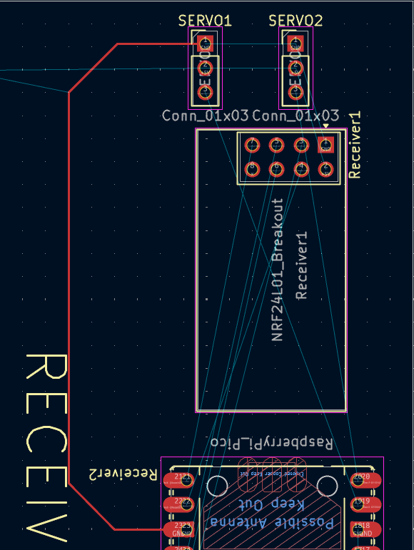

* IMPORTANT TIP: you can press V while you route to place a via. A via transfers a wire from the front side of the PCB to the back side like so: 

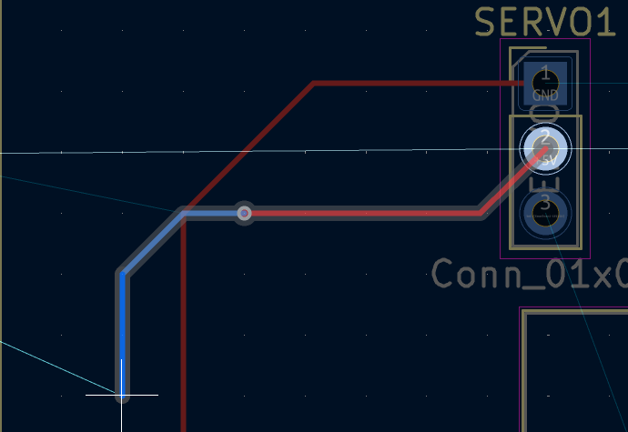

* You can also route starting from the back side by selecting the B.Cu layer.

* You can also ignore the GND and 5V ratlines crossing into the other side

This is what my routed PCB looked like:

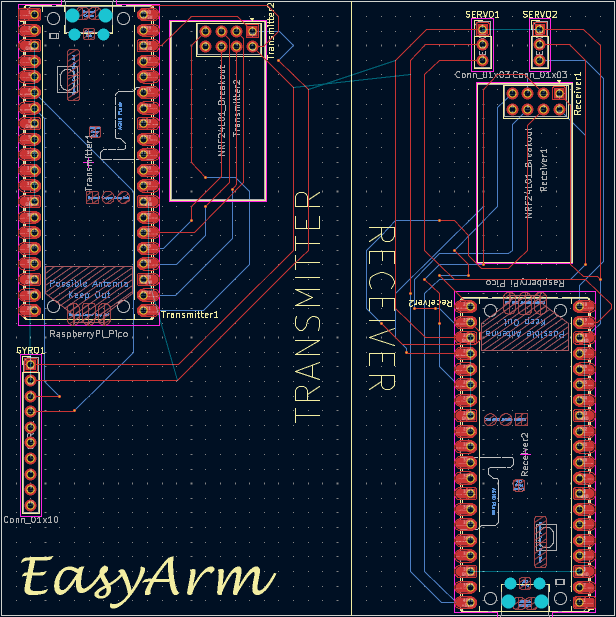

# Making the PCB Space themed
Since the current Kit-Lab theme is space, we will make our PCB space themed! To do this, find a space-themed picture and download it, for example, I chose this one:

Now, go to your KiCad main menu, and select the Image Converter:

And then select the "Load Image Source" button and them insert the image you downloaded. After that, select the "Export to Clipboard" button and then simply go back into your PCB to paste the image! You can also change the ourput size before you export if your image is too large/small (I recommend leaving the Lock height / width ratio option on). Here's mine for example:

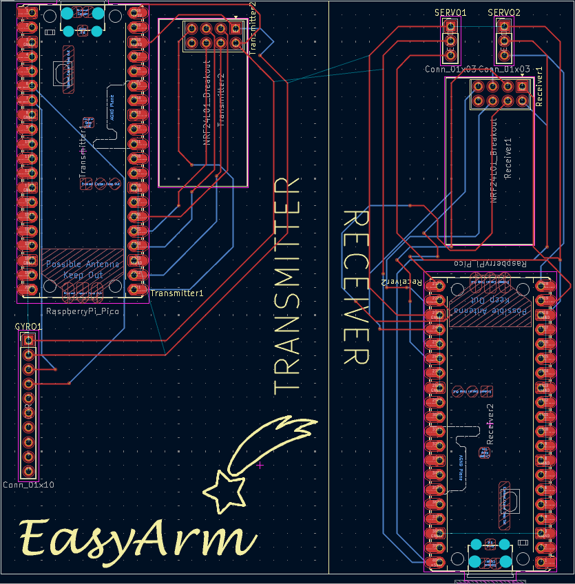

Make sure you add more than 1!

Now we are one half of the way done! We just now have to make the case and do the arm's firmware!

# Designing the Case

Now that we have finished with the PCB part of this project, we will now start designing the case for our arm! The arm will need a case so that it actually can move pieces.
To start off, go download Fusion360 since that is what we will be using for this proejct's case. You can use other CAD software but it might be harder since the controls and functions might be different.

We will first create a new project, to do this, just click the + button on your top toolbar and you should see a menu pop up. Select "Part Design" and then a new design tab should be there.

Next, press the Create Sketch button on the Solid tab, which looks like this:

After you press that, 3 squares should pop up, select the square on the side you want it to be on, I usually select the square on the bottom and with the x and y axis. Now, you should see a sketch palette pop up. 
Press R to start creating a rectangle and then make a random rectangle. This will soon be the base of our Transmitter. Now we will set the length of our sides using the Sketch Dimension tool which looks like this:

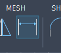 

You also could just press D for it as well. After we select the tool, we will select one side and set it to the width of our PCB and increase it by 1 mm. (my PCB is 100mm so I will set it to 101mm) and also do the same with the height of the PCB.

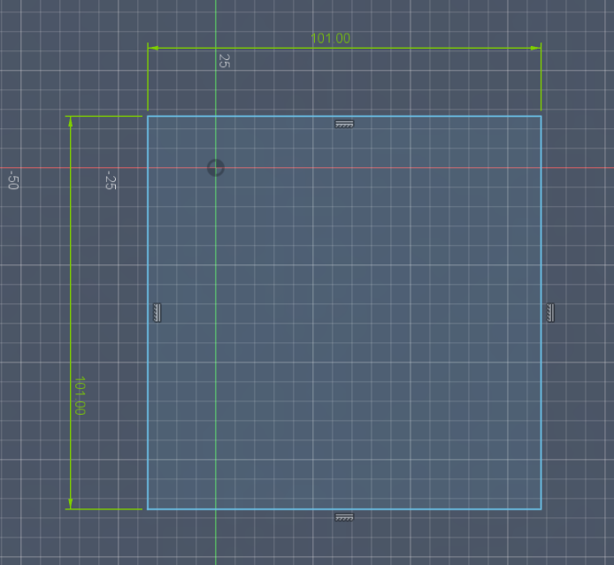

Also create another rectangle that is 20mm bigger on each side on top of the first rectangle.:

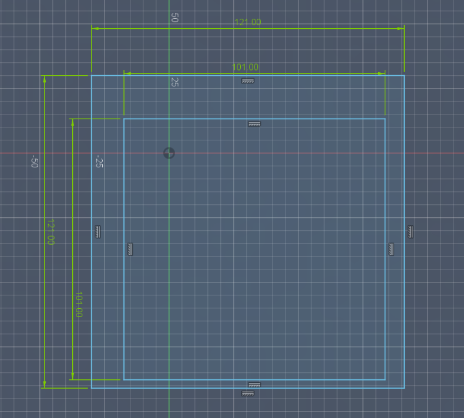

And then use the Sketch dimension tool and then select one edge of the smaller rectangle and then select the corresponding edge of the bigger rectangle and then set the value to 10mm. Do the same for the other edge and you only need to do this once for the horizontal edge and once for the vertical edge like so:

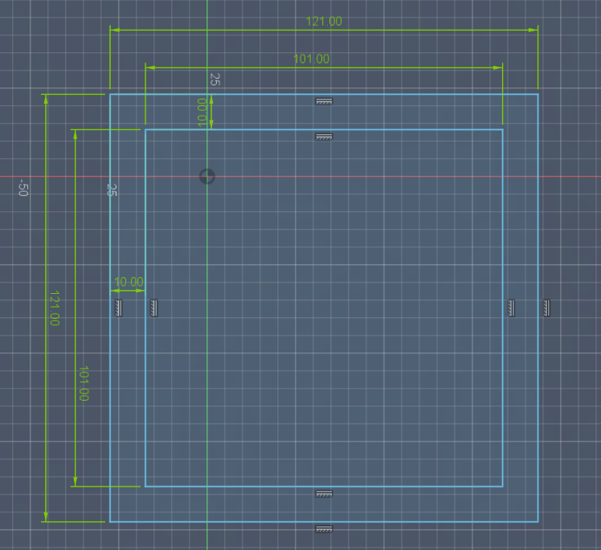

Now click the "Finish Sketch" button on the top right corner:

 
And now there should be two blue retangles. We will now extrude the squares. To do this, select the extrude to or just press E (it should be next to the create sketch button):

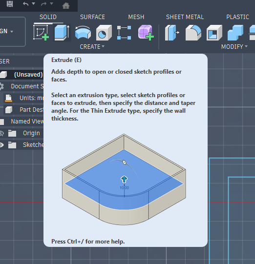

And then select the smaller interior square and then set the distance to 2:

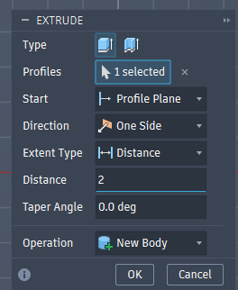

Then you will see the outer rectangle go away so select the sketches folder in the browser and then open it's dropdown and then press the eye button on Sketch 1:

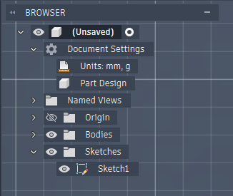

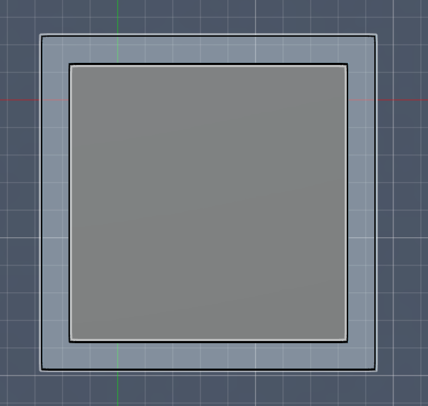

Now select the outer rectangle and extrude it by 12mm and it should finally look like this:

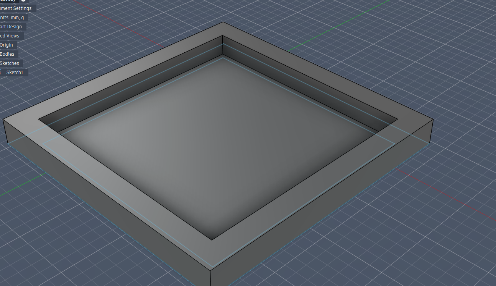

And now that we have created the case for the transmitter, we will now add a hole for the USB port of the Pico.