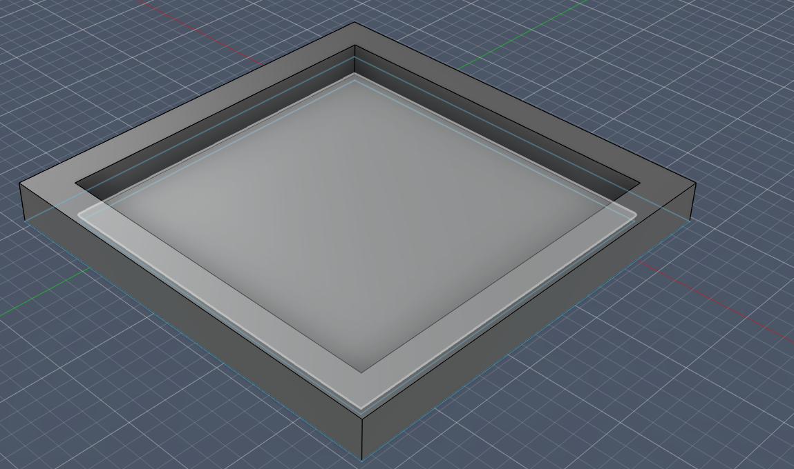

# (3/13/2026) Started with the schematic!!
START TIME: 10:32 AM
END TIME: 11:45 AM

I added the parts needed to the schamatic layout and started connecting them. I used 1x3 header pins for the servo connections and a breakout symbol for the wireless communication module, I also used a 1x10 header pin connection for the gyroscope module.
I also started typing the guide and got the part where you create the schematic done.

# (3/13/2026) Finished with schematic part of guide and finished schematic!!
START TIME: 2:00 PM
END TIME: 6:00 PM

Today, I took some more time to work on the schematic part of the guide and my schematic and finished both! I connected everything together and also used a diagram from pico.pinout.xyz to help me wire the things up.

# (3/19/2026) Finished Routing PCB!!
START TIME: 12:07 PM
END TIME: 5:21 PM

Today, I worked on the guide some more while I routed the PCB. I managed to finish both the routing part of the guide and the routing of the PCB. I will now have to make the PCB space themed and I plan so by using stars on the PCB silkscreen.

# (4/7/2026) Almost Finished with Transmitter Case!!
START TIME: 8:34
END TIME: 9:32

Today, I started with the CAD of the case for the Transmitter in Fusion. I got though creating the 2 rectangles (one 1mm bigger on each side than and PCB and another one 20mm bigger on each side on top of it with 10mm space from each of the sides) but still have to create a hole to make the USB port of the Pico accessable and I also have to filet the edges of the case to make it look nicer. The only reason it took me this long a while is that I had to also work on the tutorial and had to explain everything since the people following the turorial might not be experienced in CAD and this might be their first PCB/hardware project that they have designed.

