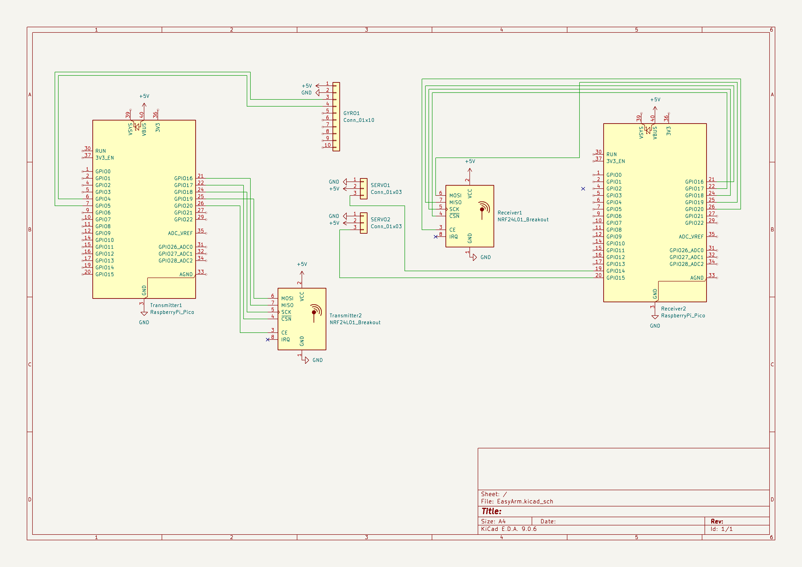

# (3/13/2026) Started with the schematic!!
START TIME: 10:32 AM
END TIME: 11:45 AM

I added the parts needed to the schamatic layout and started connecting them. I used 1x3 header pins for the servo connections and a breakout symbol for the wireless communication module, I also used a 1x10 header pin connection for the gyroscope module.
I also started typing the guide and got the part where you create the schematic done.

# (3/13/2026) Finished with schematic part of guide and finished schematic!!
START TIME: 2:00 PM
END TIME: 6:00 PM

Today, I took some more time to work on the schematic part of the guide and my schematic and finished both! I connected everything together and also used a diagram from pico.pinout.xyz to help me wire the things up.

# (3/19/2026) Finished Routing PCB!!
START TIME: 12:07 PM
END TIME: 5:21 PM

Today, I worked on the guide some more while I routed the PCB. I managed to finish both the routing part of the guide and the routing of the PCB. I will now have to make the PCB space themed and I plan so by using stars on the PCB silkscreen.